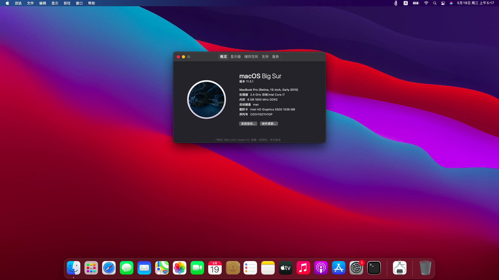

# LENOVO-G50-80-V3000-Hackintosh
OpenCore configs for Lenovo g50-80, g40-80, v3000.

#### 当前测试v3000，理论上g40-80、g50-80也可使用。特点：OpenCore引导，未直接使用DSDT.aml，睡眠唤醒完美。

## macOS Big Sur

## 硬件清单

| 硬件         | 说明                                                         |
| ------------ | -------------- |
| CPU          | 英特尔 Core i7-5500u        |
| 显示屏       | 13.3 1080P                  |
| **核显**     | **HD5500**                                                   |
| 独显         | AMD R5-M330 2GB（**已屏蔽**）  |
| 硬盘         |  ( 256 GB / 固态硬盘 )                |
| **声卡**     | **Conxeant SmartAudio HD (Codec CX20751/2)**           |
| 有线网卡     | Realtek RTL8111          |
| **无线网卡** | **BCM94352Z**                        |
| 蓝牙         | Broadcom  20702A3     |
| 读卡器       | Realtek USB2.0 Card-Reader（可在虚拟机中驱动，推荐Parallels的Win10融合模式） |
| USB接口      | 两个USB2.0+一个USB3.0                                        |
| 摄像头       | 普通集成摄像头                                               |

## 驱动状态

| 文件                  | 说明                                                         |
| :-------------------- | :------------------ |
| 显卡            |   OK   |
| 声卡            |   OK   |
| 电池            |   OK   |
| 有线网卡            |   OK   |
| wifi            |   OK   |
| 蓝牙            |   OK   |
| 摄像头            |   OK   |
| 亮度调节            |   OK   |
| 睡眠唤醒            |   OK   |
| 盒盖/开盖            |   OK   |
| 触摸板            |   OK   |
| 读卡器            |   未驱动，可直通usb在虚拟机中驱动   |

## 更新日志

#### v1.0 --- 2021-05-19

  - 初始版本
  - OpenCore: 2.6.9

## FAQ

1. **nothing**

   nothing

## 帮助

- [Acidanthera](https://github.com/acidanthera)
- [OpenIntelWireless](https://github.com/OpenIntelWireless)
- [1Revenger1](https://github.com/1Revenger1/ECEnabler)
